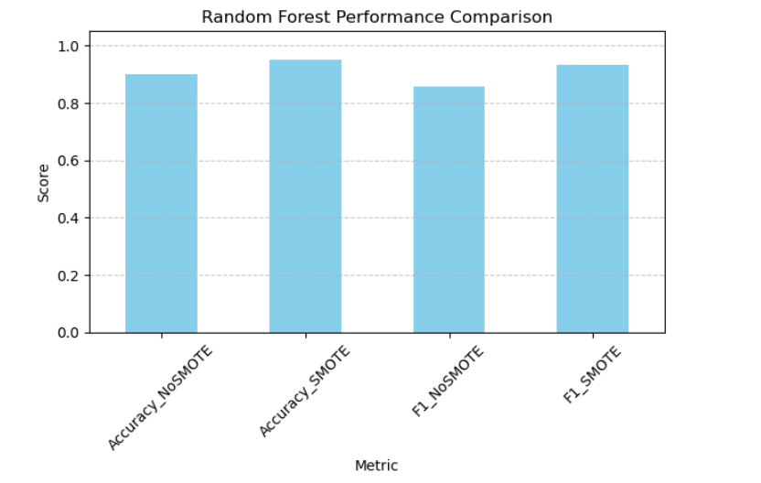
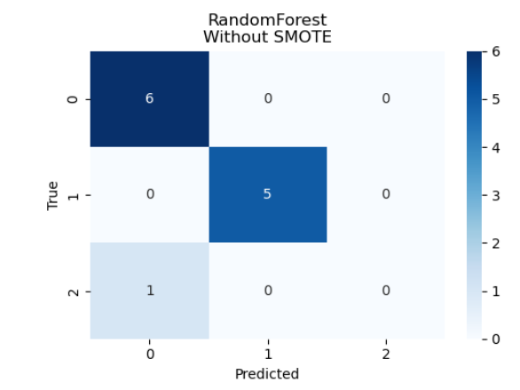
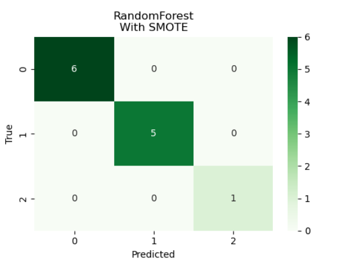

## Random Forest Performance Summary

Random Forest achieved:
- Accuracy: 90.0% (No SMOTE) → 95.0% (With SMOTE)
- F1 Score: 85.7% (No SMOTE) → 93.4% (With SMOTE)

This demonstrates the impact of SMOTE on improving classification performance.

## Accuracy Comparison Across Models

> This bar graph shows how Random Forest outperforms other models, especially when SMOTE is applied.

---

## Confusion Matrix – Without SMOTE

> The confusion matrix reveals misclassifications due to class imbalance.

---

## Confusion Matrix – With SMOTE

> After applying SMOTE, the confusion matrix shows improved balance and fewer misclassifications.
